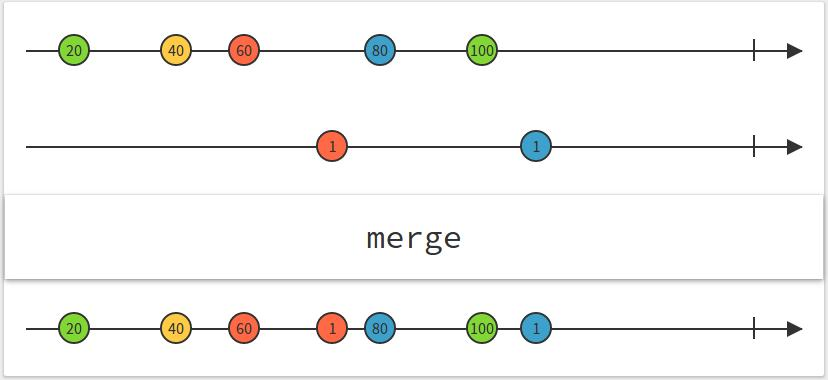
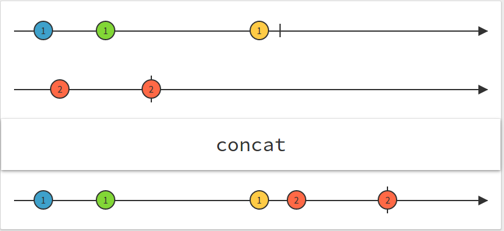
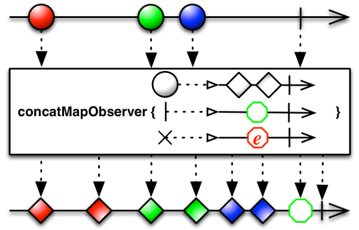

# Reactive Programming
### Observables with RxJS


----


### Why not promises?

* Promises resolve/reject once and only once
* Not ideal for streaming/"infinite" data


---


# Reactive (RX) Pattern

* Developed by Microsoft [(rx.codeplex.com)](http://rx.codeplex.com)
* Cross between the Observer pattern and the Iterator pattern:
  * *Observables* push values over time
  * *Observers* receive values as they become available

----

### Differences between the Observer and Iterator Pattern:

  * Observables don't start streaming until at least one Observer is attached to it
  * Observables can signal when the sequence is complete


---


# Basic Observable and Observer creation


----


## Observable

* Creation Helper methods
  * Rx.Observable.create -> explicit creation
  * Rx.Observable.from
  * Rx.Observable.fromEvent
  * Rx.Observable.range
  * Rx.Observable.interval


----


**Rx.Observable.create**

```javascript
let obs = Rx.Observable.create(observer => {
  let val = 0;
  while(val < 10) {
    observer.onNext(val++);
  }
  observer.onCompleted();

  return funtion() {
    console.log('Dispose logic here');
  }
});

```


----


## Observer

```javascript

let disposable = obs.subscribe(
  x => { console.log(`next: ${x}`) },  // next: 0 next: 1...next: 9
  e => { console.log(`error: ${e}`) }, // error handler
  () => { console.log(`onCompleted`) },// complete handler
);

disposable.dispose(); // Dispose logic here

```
Can also use `obs.forEach(onNext, onError, onCompleted)`

----


**Rx.Observable.from**
* Create an Observable from an array-like or iterable object
  * Works with arrays, strings, Maps, Sets, Generators, etc...

```javascript
import { Observable } from 'rx';

let m = [1, 2, 3, 4, 5],
    obs = Observable.from(m);

obs.forEach(x => { console.log(x); }); // 1, 2, 3, 4, 5

let foo = 'foo',
    obs = Observable.from(foo);

obs.subscribe(x => { console.log(x); }); // f o o

```


----


**Rx.Observable.fromEvent**
* Creates Observable from eventListener from the matching:
  * DOMElement, jQueryElement, Angular element, Ember element or Event Emitter

```javascript
import { Observable } from 'rx';
let mouseMoves = Observable.fromEvent(document, 'mousemove');

mouseMoves
  .subscribe(e => {
    console.log(`(${e.clientX}px, ${e.clientY}px)`)
    // (124px, 322px) (125px, 321px)...
  });

```

----


**Rx.Observable.range**
* Creates a stream of integers starting with the first value, incrementing by 1 until the total number is reached (second argument)

```javascript
import { Observable } from 'rx';
let obs = Observable.range(1, 20);

obs.subscribe(x => { console.log(x); }); // 1 2 3 4 5...20

Observable.range(5, 2).forEach(x => { console.log(x); }); // 5 6

```

----


**Rx.Observable.interval**
* Creates a never-ending* stream of objects at the given interval

```javascript
import { Observable } from 'rx';
let obs = Observable.interval(500);
obs.subscribe(x => { console.log(x); });
// { value: 0, interval: 500} { value: 1, interval: 500 } .......

```

---


# Observables as Streams of Events

* Transform
* Combine


---


## Transformations
The Basic Operators for stream transformations are almost identical
to their `Array.protoytype` counterparts.

All Transformations return a **NEW** Observable.  

Most commonly used Transforms:

* Map
* Filter
* Reduce

(There are dozens of other transformation operations)


----


## Map

```javascript
import { Observable } from 'rx';

let obs = Observable.range(1, 100);
let newObs = obs.map((el, indx, observ) => el * el);

obs.forEach(x => { console.log(x); });    // 1 2 3 4 5 6...100
newObs.forEach(x => { console.log(x); }); // 1 4 9 16 25 36...10000

```

----


## Filter

```javascript
import { Observable } form 'rx';

let obs = Observable.range(1, 100)
            .filter((x, idx, obs) => x % 2 === 0);

obs.subscribe(x => { console.log(x); }); // 2 4 6 8 10 12 ... 100

```

## Reduce

```javascript
import { Observable } form 'rx';

let obs = Observable.range(1, 100)
            .reduce((acc, x, idx, obs) => {
              return acc + x;
            } /*, optional seed here */);

obs.forEach(x => { console.log(x); }); // 5050

```

---


## Combine

Strategies for combining multiple Observables into a single Observable sequence.

* Merge
* Concat
* ConcatMap
* TakeUntil
* take


----


## merge
* Merges in the value as it arrives from any source



----


```javascript
import { Observable } from 'rx';

let src1 = Observable.interval(100).map(x => `A${x}`).take(5);
let src2 = Observable.interval(200).map(x => `B${x}`).take(5);

Observable.merge(src1, src2).subscribe(x => { console.log(x); });
// A0 A1 B0 A2 A3 B1 A4 B2 B3 B4
```

----


## concat

* Merges one stream first then tacks on the next stream in its entirety, etc...




----


```javascript
import { Observable } from 'rx';

let src1 = Observable.interval(100).map(x => `A${x}`).take(5);
let src2 = Observable.interval(200).map(x => `B${x}`).take(5);

Observable.concat(src1, src2).subscribe(x => { console.log(x); });
// A0 A1 A2 A3 A4 B0 B1 B2 B3 B4
```


----

## concatMap

* When a map operation returns another Observable sequence, `concatMap` allows us to flatten into a single Observable.




----

## takeUntil

* Allows us to keep observing one Observable until another Observable pushes a values


